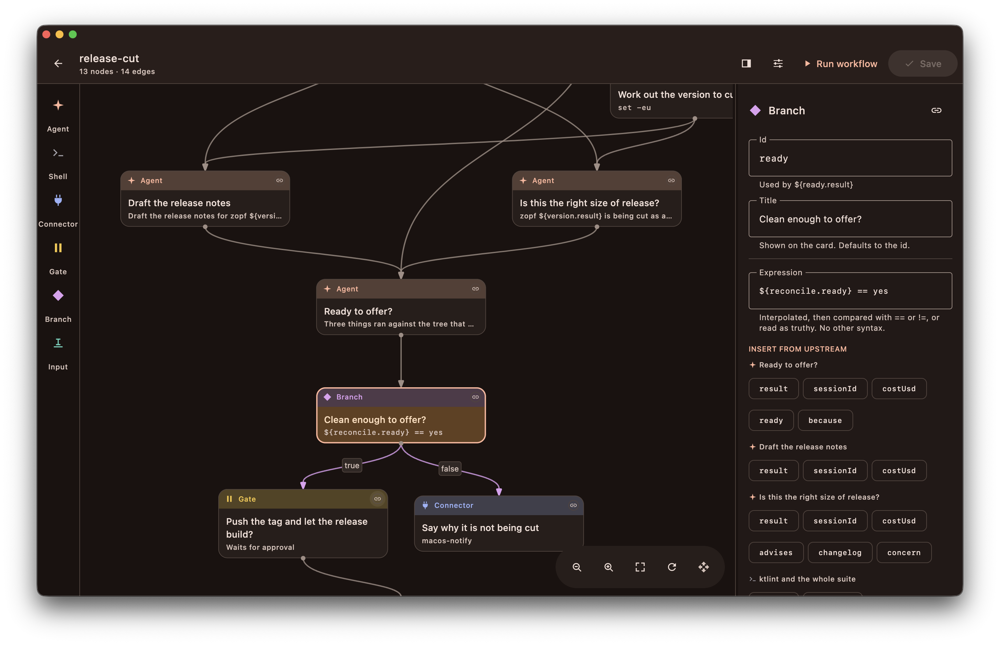

<p align="center">
  
</p>

<h1 align="center">zopf</h1>

<p align="center">
  <b>A macOS app for running agent workflows as a graph.</b>
</p>

zopf allows you to connect several claude, codex or deepseek sessions into a graph and run them together instead of one
terminal session at a time. You can also span this across multiple directories and invoke skills and other context on
the side.

It runs claude code in the non-interactive mode using `claude -p`, but you can also use codex or DeepSeek Harness
instead. There's also a CLI which allows you to run zopf workflows headlessly.

<p align="center">
  <a href="https://github.com/justdeko/zopf/releases/latest/download/zopf-macos-arm64.dmg">
    
  </a>
</p>

<p align="center">
  
</p>

## Features

* Live output with cost and elapsed time
* Take a session over in your terminal
* Menu bar as an overview of your runs and workspace
* Gates to pause a run for your approval
* Connectors to communicate with external components

## Getting Started

You need **macOS on Apple Silicon** and one of these installed and signed in:

| CLI                                                                                  | `provider:` | What zopf runs              |
|--------------------------------------------------------------------------------------|-------------|-----------------------------|
| [Claude Code](https://code.claude.com/docs/en/quickstart#step-1-install-claude-code) | `claude`    | `claude -p`, streaming JSON |
| [Codex](https://learn.chatgpt.com/docs/codex/cli)                                    | `codex`     | `codex exec --json`         |
| [DeepSeek Harness](https://github.com/deepseek-ai/deepseek-harness)                  | `dsh`       | `dsh --profile headless`    |

> [!NOTE]
> So far, only the Claude Code path was used daily and tested against a real CLI. The codex and dsh paths are built from those
> CLIs' documented flags and covered by unit tests, but they haven't been tested end to end here.
> Please open an issue if you notice a bug in their implementations.

### The App

Download `zopf-<version>.dmg` from the [latest release](../../releases/latest) and drag it to Applications. On first
launch it creates `~/.zopf` as your workspace.

### The CLI

```bash
curl -fsSL https://raw.githubusercontent.com/justdeko/zopf/main/install.sh | sh
```

That unpacks the newest release into `~/.local/opt`, links `~/.local/bin/zopf`, and adds that directory to your shell rc
if it isn't on PATH already.

The CLI does need a **JDK 17 or newer** on your PATH, you can install one e.g. with homebrew:

```bash
brew install --cask temurin
```

### From source

```bash
git clone https://github.com/justdeko/zopf && cd zopf
# basic run
./gradlew :desktopApp:run
# build the .app and open it from finder
./gradlew :desktopApp:runMacApp
 # cli/build/install/zopf-cli/bin/zopf
./gradlew :cli:installDist
```

## Workflows

A workflow is a YAML file. As an example, this one runs the test suite and only calls an agent if it fails:

```yaml
name: verify
repos:
  - id: app
    path: ~/dev/app
defaults:
  repo: app
nodes:
  - id: tests
    type: shell
    title: Run the suite
    command: npm test
  - id: diagnose
    type: agent
    title: Fix what broke
    permissionMode: acceptEdits
    prompt: |
      `npm test` just failed. Its output:

      ${tests.result}

      Find the cause and fix it, then re-run the suite and report what is green.
edges:
  - from: tests
    to: diagnose
    on: failure
```

Some things that are crucial to understanding workflow nodes:

- data along edges is implicit, you can embed it in the next node execution using literals: `${tests.result}`
- some edges have implicit assumptions like true/false from gates or `on: failure` in the example
- generally, follow the [schema reference](plugins/zopf/skills/zopf-workflows/references/schema.md)

The editor reads and writes to workflow files, so you can hand-edit it or draw it on the canvas. Or you can invoke the
[claude skills](plugins/zopf/skills) to construct one. To add them:

```
/plugin marketplace add justdeko/zopf
/plugin install zopf@zopf
```

## What you could build with it

* Fan one migration out over a dozen repos in parallel and collect a diff from each
* Review with an expensive model, then apply the fixes with a cheap one
* Summarize a folder of documents in parallel, then have a second agent write the digest
* Ask for your approval or your input in the middle of an otherwise unattended run

## Node types

| Type        | What it does                                                                                               |
|-------------|------------------------------------------------------------------------------------------------------------|
| `agent`     | A headless agent session. Set `provider: codex` or `provider: dsh` to switch CLIs (or change your default) |
| `shell`     | A command that runs in your login shell in the repo you point it at                                        |
| `connector` | A script that talks to something outside                                                                   |
| `gate`      | Stops and waits for you to approve or reject                                                               |
| `input`     | Asks you a question and passes the answer on as `${ask.result}`                                            |
| `branch`    | Picks one outgoing based on a condition, e.g.: `"${build.exitCode} == 0"`.                                 |

Steps read previous output with `${step.result}`. There's no expression language on top of it.

## Workspaces

A workspace is a `.zopf/` folder, the nearest one above you, the way git finds `.git`. Commit one inside a repo and its
workflows travel with the code; `~/.zopf` is the default for everything else. Nothing machine-specific is written into
one, so `git status` stays clean.

```
<repo>/.zopf/ or ~/.zopf/                  workflows/, connectors/, optional zopf.yaml
~/Library/Application Support/zopf/        settings.json, runs/ (every run, as replayable JSONL)
~/Library/Logs/zopf/zopf.log               what to send with a bug report
```

`zopf.yaml` is optional. It names the workspace and sets defaults for every workflow in it, using the same keys a
workflow's own `defaults` takes:

```yaml
name: Payments
defaults:
  model: sonnet
  repo: self
```

The run archive grows: a chatty build step can run to megabytes. Settings → History caps it, or `zopf prune --keep 50`.

## CLI usage

```bash
zopf run ship-feature --on-gate approve --answer env=staging
# only prints order of workflow execution
zopf run ship-feature --dry-run
# list workflows in a given folder
zopf list
# check workflow validity
zopf validate
# show past runs
zopf runs --last 5
```

Exit codes:

- `0` OK
- `1` a step failed
- `2` stopped
- `3` never started

Two things are a bit different in the cli vs. the app:

- no gate, the run just stops there
- inline approval is off, so a stricter permission mode can block the run

## Security

zopf runs on your laptop under your own account and logins. Every step is a subprocess with your file permissions.

There are no external tools or connections other than what you build yourself using connectors, scripts, and so on. The
app checks this GitHub page once a day to determine whether a newer release exists. To silence update checks:
`ZOPF_NO_UPDATE_CHECK=1` or `DO_NOT_TRACK=1`.

Point workflows at locations you'd already be willing to run from, and only ingest agent output into shell execution if
you're confident of its contents.

## Trademarks

zopf is an independent personal project. It is not affiliated with, sponsored by or endorsed by Anthropic, OpenAI,
DeepSeek, Apple or GitHub. Claude and Claude Code are trademarks of Anthropic PBC; Codex is a trademark of OpenAI;
DeepSeek is a trademark of Hangzhou DeepSeek Artificial Intelligence Co., Ltd.; macOS and Finder are trademarks of
Apple Inc. They're named here only to say which tools zopf uses.
